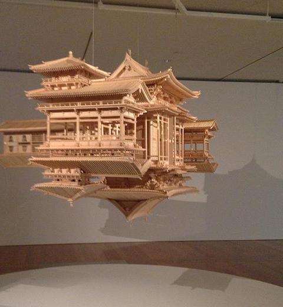

# A2RL

[[Project]](https://debangli.github.io/A2RL/)   [[Paper]]() [[Code]](https://github.com/wuhuikai/TF-A2RL)  [[Online Demo]](https://wuhuikai.github.io/TF-A2RL/)    [[API]](https://algorithmia.com/algorithms/wuhuikai/A2RL)   [[Related Work: GP-GAN (for Image Blending)]](https://github.com/wuhuikai/GP-GAN)


## Overview

| source | step 1 | step 2 | step 3 | step 4 | step 5 | output| 
| --- | --- | --- | --- | --- | --- | --- |
|  |  |  |  |  |  |  |

A2-RL (aka. Aesthetics Aware Reinforcement Learning) is the author's implementation of the RL-based automatic image cropping algorithm described in:
```
A2-RL: Aesthetics Aware Reinforcement Learning for Automatic Image Cropping   
Debang Li, Huikai Wu, Junge Zhang, Kaiqi Huang
```

Given a source image, our algorithm could take actions step by step to find almost the best cropping window on source image. 

Contact: Debang Li (DerekLee9312@gmail.com)


## Results compared with baseline methods (more [results](https://debangli.github.io/A2RL/))

|Source| VFN+Sliding window | A2-RL | Ground Truth |
| --- | --- | --- |---|
|  |  |  |  |
|  |  |  |  |
|  |  |  |  |
|  |  |  |  |
|  |  |  |  |

```
@article{li2017a2,
  title={A2-RL: Aesthetics Aware Reinforcement Learning for Automatic Image Cropping},
  author={Debang Li, Wu, Huikai and and Zhang, Junge and Huang, Kaiqi},
  year={2017}
}
```
